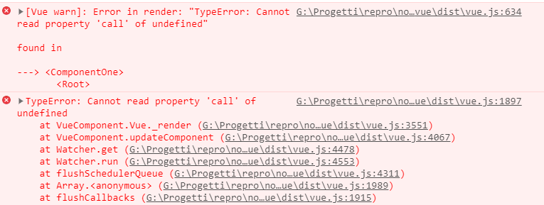

# Issue with vue-hot-reload-api
`rerender` fails when the component options object is missing a `render` function.

## Getting started
Open this project with VSCode, run `npm install`, then start debug with `F5`.

Open [components/component-one.js](components/component-one.js) and change its template, then save. An exception will be thrown.